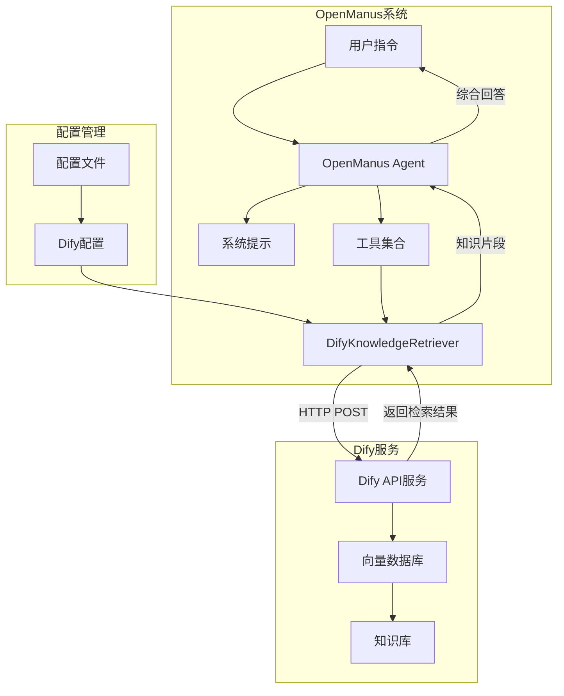
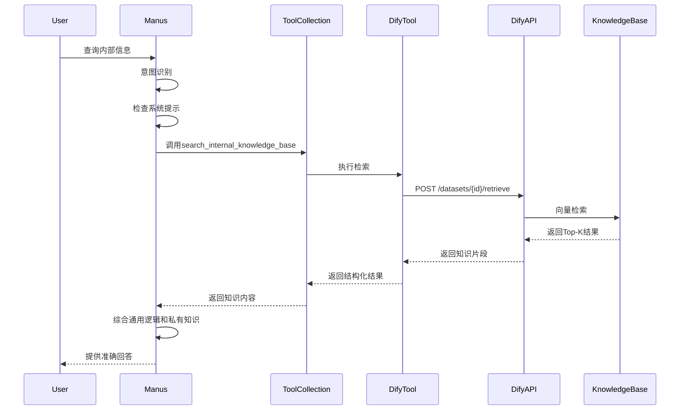

# OpenManus Dify知识库集成 - 系统架构

## 整体架构图



## 组件交互流程

### 1. 用户查询流程



### 2. 配置加载流程


## 模块职责划分

### OpenManus端职责
- **任务拆解**: 分析用户需求，识别是否需要查询知识库
- **工具路由**: 决定何时调用知识库检索工具
- **上下文理解**: 理解检索结果，结合通用知识生成回答
- **错误处理**: 处理API超时、空结果等异常情况

### Dify服务端职责
- **文档切片**: 将文档切分为适合向量化的片段
- **向量存储**: 将文本片段转换为向量并存储
- **语义检索**: 基于用户查询进行语义相似度搜索
- **结果返回**: 返回最相关的原始文本片段

## 数据流设计

### 请求数据流
```
用户查询 → 意图识别 → 工具调用 → API请求 → 向量检索 → 结果返回
```

### 配置数据流
```
配置文件 → 配置模型 → 工具实例 → API客户端 → HTTP请求
```

## 安全设计

### 认证机制
- **API密钥**: 使用Bearer Token认证
- **配置隔离**: 敏感信息存储在环境变量中
- **访问控制**: 网络白名单限制

### 数据保护
- **日志脱敏**: 避免在日志中记录完整知识库内容
- **错误信息**: 提供友好的错误提示，不泄露内部细节
- **超时保护**: 防止长时间等待导致的资源浪费

## 性能优化

### 缓存策略
- **客户端缓存**: 可考虑实现简单的查询结果缓存
- **连接池**: 使用aiohttp的连接池管理
- **异步处理**: 非阻塞的API调用

### 监控指标
- **响应时间**: API调用延迟 < 2000ms
- **成功率**: 监控API调用成功率
- **错误率**: 跟踪各类错误的发生频率

## 扩展性设计

### 多数据集支持
- 支持配置多个数据集ID
- 动态选择目标数据集
- 数据集级别的权限控制

### 检索策略扩展
- 支持不同的检索模型
- 可调节的相似度阈值
- 灵活的Top-K参数配置

## 部署架构

### 容器化部署
```yaml
# docker-compose.yml示例
version: '3.8'
services:
  openmanus:
    build: .
    environment:
      - DIFY_API_BASE=https://api.dify.ai/v1
      - DIFY_API_KEY=${DIFY_API_KEY}
      - DIFY_DATASET_ID=${DIFY_DATASET_ID}
    volumes:
      - ./config:/app/config
    networks:
      - openmanus-network

  # 可选：本地Dify服务
  dify:
    image: langgenius/dify:latest
    ports:
      - "3000:3000"
    networks:
      - openmanus-network

networks:
  openmanus-network:
    driver: bridge
```

## 故障处理架构

### 降级策略
1. **API超时**: 返回友好的超时提示
2. **空结果**: 明确告知用户无相关信息
3. **认证失败**: 提示配置错误
4. **网络异常**: 建议检查网络连接

### 重试机制
- **指数退避**: 失败后等待时间递增
- **最大重试次数**: 避免无限重试
- **错误分类**: 区分可重试和不可重试的错误

这个架构设计确保了OpenManus与Dify知识库集成的可靠性、安全性和可扩展性。
